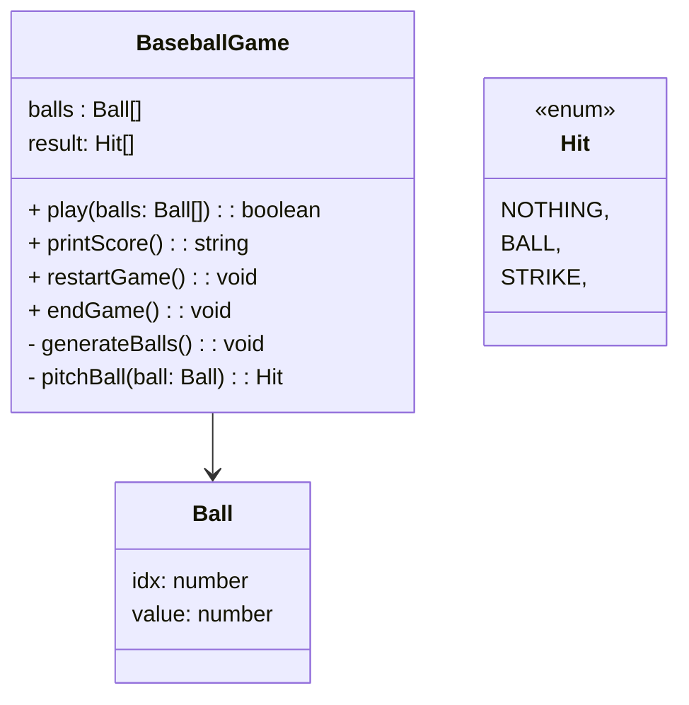

# 숫자야구게임

## 기능 요구사항

기본적으로 1부터 9까지 서로 다른 수로 이루어진 3자리의 수를 맞추는 게임이다.

- 같은 수가 같은 자리에 있으면 스트라이크, 다른 자리에 있으면 볼, 같은 수가 전혀 없으면 포볼 또는 낫싱이란 힌트를 얻고, 그 힌트를 이용해서 먼저 상대방(컴퓨터)의 수를 맞추면 승리한다.
  - e.g. 상대방(컴퓨터)의 수가 425일 때, 123을 제시한 경우 : 1스트라이크, 456을 제시한 경우 : 1볼 1스트라이크, 789를 제시한 경우 : 낫싱
- 위 숫자 야구 게임에서 상대방의 역할을 컴퓨터가 한다. 컴퓨터는 1에서 9까지 서로 다른 임의의 수 3개를 선택한다. 게 임 플레이어는 컴퓨터가 생각하고 있는 3개의 숫자를 입력하고, 컴퓨터는 입력한 숫자에 대한 결과를 출력한다.
- 이 같은 과정을 반복해 컴퓨터가 선택한 3개의 숫자를 모두 맞히면 게임이 종료된다.
- 게임을 종료한 후 게임을 다시 시작하거나 완전히 종료할 수 있다.

## 실행 결과

```
숫자를 입력해 주세요 : 123
1볼 1스트라이크
숫자를 입력해 주세요 : 145
1볼
숫자를 입력해 주세요 : 671
2볼
숫자를 입력해 주세요 : 216
1스트라이크
숫자를 입력해 주세요 : 713
3스트라이크
3개의 숫자를 모두 맞히셨습니다! 게임 종료
게임을 새로 시작하려면 1, 종료하려면 2를 입력하세요.
1
숫자를 입력해 주세요 : 123
1볼 1스트라이크
…
```

## 기능 목록

- 임의의 수 3개 생성.
- 볼 점수 계산. ball, strike, nothing
- 게임 종료 조건 확인. 3개의 수를 모두 맞히면 종료.
- 게임 재시작 및 완전 종료

## 객체 설계



## TDD TIP

### 1. Util 성격의 기능이 TDD로 도전하기 좋음

- 1~9의 숫자인가?
- 중복 값이 있는가?
- 3자리인가?

### 2. 테스트가 가능한 부분에 대해 TDD로 도전

- 위치와 숫자 값이 같은 경우 Strike
- 위치는 다르지만 숫자 값이 같은 경우 Ball
- 위치와 숫자 값이 모두 다른 경우 Nothing
